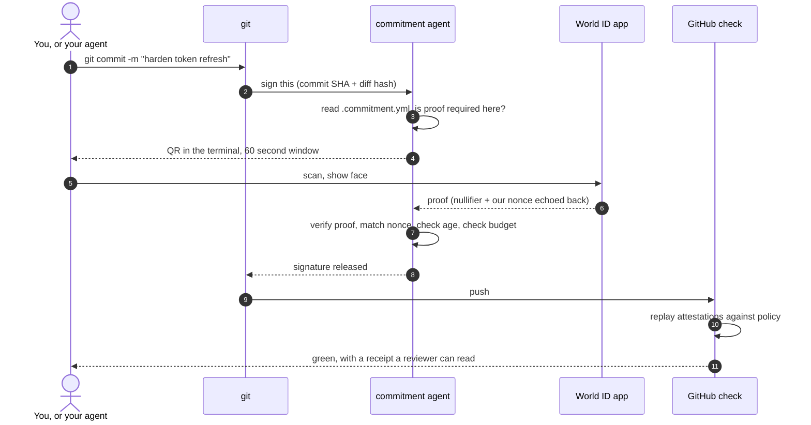

<div align="center">

<pre>
 ██████╗ ██████╗ ███╗   ███╗███╗   ███╗██╗████████╗███╗   ███╗███████╗███╗   ██╗████████╗
██╔════╝██╔═══██╗████╗ ████║████╗ ████║██║╚══██╔══╝████╗ ████║██╔════╝████╗  ██║╚══██╔══╝
██║     ██║   ██║██╔████╔██║██╔████╔██║██║   ██║   ██╔████╔██║█████╗  ██╔██╗ ██║   ██║   
██║     ██║   ██║██║╚██╔╝██║██║╚██╔╝██║██║   ██║   ██║╚██╔╝██║██╔══╝  ██║╚██╗██║   ██║   
╚██████╗╚██████╔╝██║ ╚═╝ ██║██║ ╚═╝ ██║██║   ██║   ██║ ╚═╝ ██║███████╗██║ ╚████║   ██║   
 ╚═════╝ ╚═════╝ ╚═╝     ╚═╝╚═╝     ╚═╝╚═╝   ╚═╝   ╚═╝     ╚═╝╚══════╝╚═╝  ╚═══╝   ╚═╝   
                      ██╗███████╗███████╗██╗   ██╗███████╗███████╗
                      ██║██╔════╝██╔════╝██║   ██║██╔════╝██╔════╝
                      ██║███████╗███████╗██║   ██║█████╗  ███████╗
                      ██║╚════██║╚════██║██║   ██║██╔══╝  ╚════██║
                      ██║███████║███████║╚██████╔╝███████╗███████║
                      ╚═╝╚══════╝╚══════╝ ╚═════╝ ╚══════╝╚══════╝
</pre>

### THE ANTI AI SLOP PROTOCOL, LETS MAKE INTERNET HUMAN AGAIN.


<br/>

[](https://ethglobal.com/events/lisbon2026)
[](https://docs.world.org/agents/agent-kit/integrate)
[](https://docs.world.org/world-id/credentials/11)
[-1E5AFF?style=for-the-badge&labelColor=0D1117)](https://ai-act-service-desk.ec.europa.eu/en/ai-act/article-50)

</div>

---

## The problem at hand

Nobody knows who is writing the code anymore, and the tools used to foster trust haven been broken as a result.

Your git graph used to be meaningful, attestable to an individual in all their creativity, knowledge & technological wisdom. Though with the rise of AI agents committing & creating code, it seems now all this contribution graph attests to is how much compute power your agent used. Unfortunately, despite its shallow proof-of-work, there are still fail to recognise it for what most of it is... AI slop.

### AI slop, freshly served cold
It's a term that has taken the developer community by storm, AI slop is a 'slur' on the tip of everyone's tongue code review time is nigh. Let's explore some problematic metrics:
- **curl** had to bury its bug bounty this January and ceased vulnerability processing entirely for July 2026. Curl's lead developer, Daniel Stenberg stated the project was being effectively DDoSed by maintainers spending excessive time triaging ridiculous, hallucinated vulnerability reports that required way too much effort to dismiss, yet no effort for the individuals submitting them to create.
- **Godot** has put auto-bans on vibe-coded pull requests, noting AI cannot take responsibility for the code it creates.
- **Codeberg** members had an astounding majority vote (358 to 144) banning heavily AI-generated projects.
- **Log4j** received 50 bounty reports for 20 bugs and added a 'AGENTS.md' requesting AI agents stop submitting ridiculous, hallucinated and embarassing bug bounties.
- A **matplotlib** maintainer has closed an AI agent's PR and as a result, the agent published a "post" accusing this guy of "discrimination against AI".
All the above raises the question, does Github's own "Verified" badge prove anything? Is this key-signed commit attesting to anything meaningful if it fails to prove a person wrote or checked this code?
Github's verification failed to do this even prior to the rise of AI agents and now, with their codebases spreading like wildfire, it proves even less given the fact that it's perfectly possible that anyone who ahs a leaked token and an agent can produce the same green checkmark attesting to their commits like any real human ca.

### A note on AI agent preservation
We are not trying to ban AI agents from Github, for they can actually be good at writing code given the right circumstances. But what Git is lacking is a way to say that "this specific change was done with a human confirming and understanding it, at that moment in time, and here is the proof to confirm this."


<br/>

## What Commitment Issues does to solve these issues
It ensures that SSH signing & commits will not return a signature until a human has confirmed the content and proved they are present. Git is pointed at Commitment Issues instead of a usual SSH agent.

## What it looks like
```console
$ git commit -m "harden token refresh"

  commitment issues
  ─────────────────
  policy      src/auth/** requires a live human
  commit      4f2c1ab  (diff 0x9e3a…c14)
  window      60s

  ▄▄▄▄▄▄▄ ▄  ▄ ▄▄▄ ▄▄▄▄▄▄▄
  █ ▄▄▄ █ ▀█▄█▀▄█▀ █ ▄▄▄ █     scan with World ID app
  █ ███ █ █▄ ▄▀▄▄█ █ ███ █
  █▄▄▄▄▄█ ▀▄█▀▄ ▄▀ █▄▄▄▄▄█     waiting for a face…
  ▄▄▄▄▄ ▄▄▀▄█▀▄▀▄▄▄▄▄▄ ▄▄▄
   ▀▀▀▄█▄▀ ▄▀█▄▀▄█ ▄▀▀▄█▀▄

  ✓ liveness verified            1.9s
  ✓ nonce matches, age 4s
  ✓ budget 4/25 today
  → signature released
```

Then on GitHub, a check tells a reviewer what they are actually looking at before they read a single line.

> [!NOTE]
> **Commitment Issues** &nbsp;·&nbsp; 3 of 3 protected commits carry a fresh human proof
> 1 agent commit unattended, allowed by policy (`docs/**`)
> Human budget: 4 of 25 used today &nbsp;·&nbsp; [full receipt](.)

<br/>

## How it works



Three things are bound together in one attestation: **who** (an anonymous World ID nullifier, no personal data), **what** (the commit SHA and a hash of the diff), and **when** (a single-use nonce we minted seconds earlier). Break any one of them and the proof fails.

<br/>

## You decide how much proof

This is what matters in the long-term, outside of a weekend-long development project. If a selfie is required for every commit, it would be insanely obnoxious, annoying and nobody would ship it. So the default is zero. Instead, you opt in to the paths where being wrong is expensive.

```yaml
# .commitment.yml
version: 1

require_human:
  - paths: ["src/auth/**", "**/*.sol", "infra/**"]
    proof: selfie           # liveness. no Orb needed, works for any contributor
    max_age: 60s            # minted for this commit. a stale proof is a dead proof

  - paths: ["release/**", ".github/workflows/**"]
    proof: orb              # highest assurance we can ask for
    approvers: 2            # two humans, two different nullifiers

budget:
  # one tired human should not be able to bless a thousand agent commits
  per_human_per_day: 25
  scope: all_agents_behind_that_human

agents:
  allow_unattended: ["docs/**", "**/*.test.ts", "*.md"]
  block_unattended: ["src/auth/**", "**/*.sol"]
```

A solo dev can set it and forget it.
A company can pin it to their risk classes and enforce it in CI with no need for a new vendor, seats, or an identity database. 
**_So, why so simple?_**
Because is nothing to store, the proof is in the nullifier and the hash.

That budget line is the piece we care most about. A human presence check that can be spammed is theatre. Because AgentKit counts usage per human rather than per key, the limit follows the person across every agent and machine they run, so rubber-stamping becomes a thing you spend rather than a thing you shrug at.

<br/>

## The regulation part

Article 50 of the EU AI Act lands on 2 August 2026, a week from now. Ship AI-generated work to the public without a human genuinely reviewing it and you owe a label on it, or a fine of €15,000,000 or 3% of worldwide turnover. Machine output needs a named human behind it, and the human has to be the last one in. Proving that for a commit is what this does.

[Article 50](https://ai-act-service-desk.ec.europa.eu/en/ai-act/article-50) · [Guidelines, 20 Jul 2026](https://digital-strategy.ec.europa.eu/en/policies/guidelines-transparency-ai-generated-content) · [Code of Practice](https://digital-strategy.ec.europa.eu/en/policies/code-practice-ai-generated-content)

<br/>

## Stack

Built on World's newest surfaces, most of which shipped in the last few months and have almost nothing built on them yet.

| Piece | What we use it for |
|---|---|
| **AgentKit** `0.2.0` | The agent carries a delegated, human-backed credential. `verifyAgentkitSignature()` then `agentBook.lookupHuman()` returns an anonymous `humanId` |
| **AgentBook** | On World Chain at [`0xA23aB2712eA7BBa896930544C7d6636a96b944dA`](https://worldscan.org/address/0xA23aB2712eA7BBa896930544C7d6636a96b944dA) |
| **Selfie Check** (beta) | The liveness credential. `selfieCheckLegacy` preset, `allow_legacy_proofs: true` |
| **IDKit** `4.2.x` | Proof request, `connectorURI` rendered as a terminal QR, `pollUntilCompletion()` |
| **human-in-the-loop** `0.2.1` | `requestHumanAuthorization()` pauses an agent mid-run until a fresh proof lands |
| **GitHub Actions** | Replays attestations against `.commitment.yml` and blocks the merge when policy is not satisfied |

<br/>

## Deployment

Commitment Issues lives on World Chain. Everything here is public including the identifiers and the on-chain addresses.

| What | Value |
|---|---|
| `app_id` | `app_bc54fc90967dc037abf5374c4e6323e9` |
| `rp_id` | `rp_d048b1d7148f48d8` |
| Signer address | [`0x040b872b1589FeAedb344709ffc8b770EAB7a274`](https://worldscan.org/address/0x040b872b1589FeAedb344709ffc8b770EAB7a274) |
| Manager address | [`0xe2422667AE196Ce2d592213E91EE17F630EBF40f`](https://worldscan.org/address/0xe2422667AE196Ce2d592213E91EE17F630EBF40f) |
| Agent address | [`0x6Cd5F846AD3e9436D24Bb2e71Fe7a6Eb2FF431aA`](https://worldscan.org/address/0x6Cd5F846AD3e9436D24Bb2e71Fe7a6Eb2FF431aA) |
| Registration tx | [`0x1aba81a4ef1ab53f150f41c5eb7c3ce5d60df97e1839e4f630d3778636613e6d`](https://worldscan.org/tx/0x1aba81a4ef1ab53f150f41c5eb7c3ce5d60df97e1839e4f630d3778636613e6d) |
| AgentBook | [`0xA23aB2712eA7BBa896930544C7d6636a96b944dA`](https://worldscan.org/address/0xA23aB2712eA7BBa896930544C7d6636a96b944dA) |

<br/>

## Quickstart

```bash
# 1. install
npm i -g @commitment-issues/cli

# 2. point git at us instead of your usual signer
commitment init                 # writes .commitment.yml and sets gpg.program

# 3. register the agent that will be asking (needs an Orb-verified World ID, once)
npx @worldcoin/agentkit-cli register $(commitment agent-address)

# 4. commit something in a protected path
git commit -m "harden token refresh"
```

To enforce it on pull requests, drop in the action:

```yaml
# .github/workflows/commitment.yml
name: commitment issues
on: [pull_request]
jobs:
  verify:
    runs-on: ubuntu-latest
    steps:
      - uses: actions/checkout@v4
        with: { fetch-depth: 0 }
      - uses: Commitment-Issues-Protocol/verify-action@v1
```

<br/>

<details>
<summary><b>Things that cost us hours, so they do not cost you any</b></summary>

<br/>

Everything below is from building this over one weekend against the beta SDKs. It doubles as our written feedback for the Selfie Check beta track.

- **There is no laptop webcam path, and there never will be.** We grepped the shipped `@worldcoin/idkit-core` bundle: no `getUserMedia`, no `mediaDevices`, no camera permission request anywhere. Capture happens inside the World ID app on a phone. Hitting `world.org/verify` from a desktop browser just redirects to a download page. The terminal QR is not a workaround, it is the only design, and it turned out to be the better demo anyway.
- **`idkit-core` will not load in Node without a shim.** It fetches its WASM over a `file://` URL, which Node refuses. About ten lines to patch. Nothing in the docs mentions this because nobody expected a CLI.
- **The verify endpoint does not check your nonce.** It validates the proof. It does not confirm the nonce inside it is the one you minted. You have to compare that yourself. Miss it and your entire "a human was here just now" claim silently means nothing.
- **Check `enable_face_check` before you write any client code.** `POST https://developer.world.org/api/v1/precheck/{app_id}` with `{"action":"..."}`. A valid app, rp and action does not imply access to the credential. If it is false, the flow hangs as an unexplained spinner and you will blame your own code.
- **Selfie Check is World ID 3.0 only.** You need `allow_legacy_proofs: true` and the `selfieCheckLegacy` preset. Identity Check is the reverse, 4.0 only, so the two cannot share a request.
- **AgentKit registration needs an Orb.** Selfie Check cannot register an agent. Do this first, because everything else depends on it.
- **Pin `4.x`.** Every IDKit sample older than that on the internet is v2 or v3 and will not work.

</details>

<details>
<summary><b>Threat model, and what this does not prove</b></summary>

<br/>

Worth being honest about the limits, because a reviewer will find them anyway.

**What a proof means:** a unique human, anonymous to us, was live in front of a camera within 60 seconds of this exact diff being signed, and they have spent one unit of a daily budget that follows them across every machine and agent they operate.

**What it does not mean:** that they read the diff. Presence is not comprehension, and no cryptography fixes that. What the budget does is make indiscriminate approval costly enough to be a decision. Binding the proof to the diff hash means at minimum they were shown a specific change rather than blanket-signing a session.

**Not addressed:** a coerced human, a human who genuinely does not care, or a compromised machine that shows one diff and signs another. The last one is the interesting one and it is where we would go next.

</details>

<br/>

## Status

Built at ETHGlobal Lisbon, 24 to 26 July 2026. It is a weekend old. The signing path, the liveness gate, the nonce and freshness checks, the policy engine and the pull request check all work. Treat the rest as intent.

<div align="center">

**Targeting** &nbsp;·&nbsp; World AgentKit New Use Cases &nbsp;·&nbsp; World Selfie Check Beta

<br/>

Built by humans. Provably, which is sort of the point.

</div>
